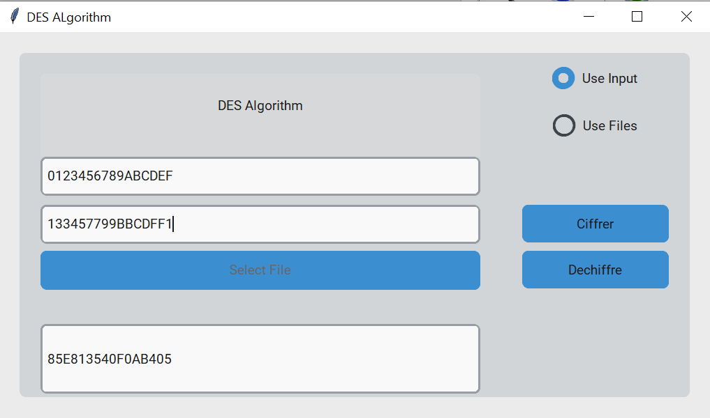
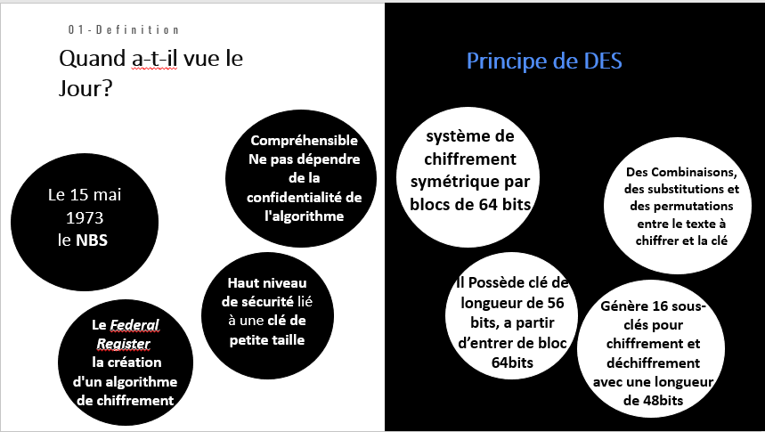
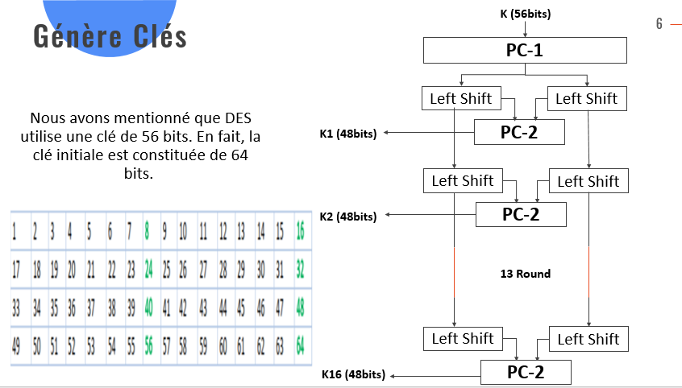
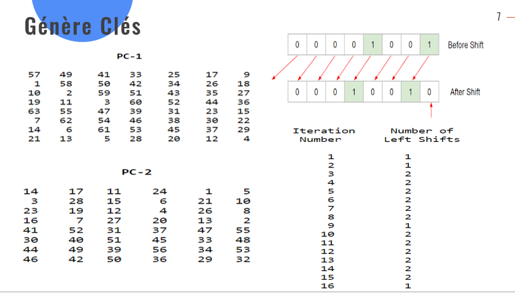
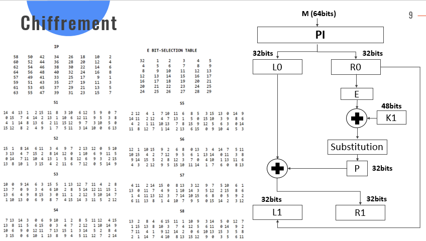
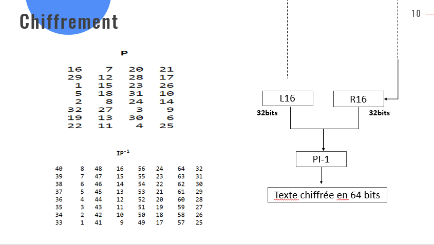
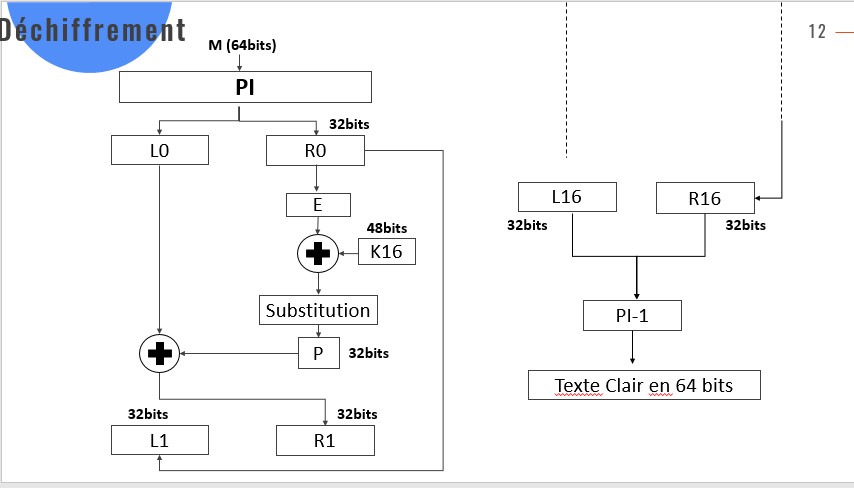
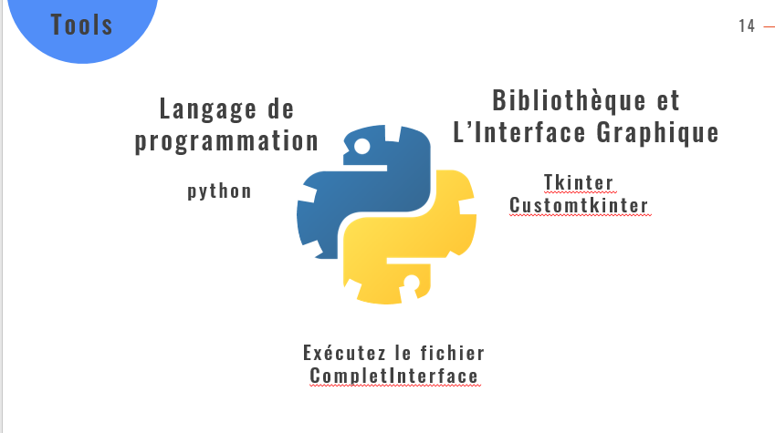

# DES-Algorithm
## Interface Of DES Algorithm 

 

So like you could show in the image above which represent our code interface there are many features of encryption and decryption whether files or just texts.
In our code we use just hexadecimal data whatever for text encrypted or normal also for key

## Definition Of DES Algorithm 

 

## Create 16 subkeys, each of which is 48 bits long.

 
 

## Encrypt every 64-bit block of data

 
 

##Decrypt every 64-bit block of data 

 

##Tools used in this algorithm code:

 
